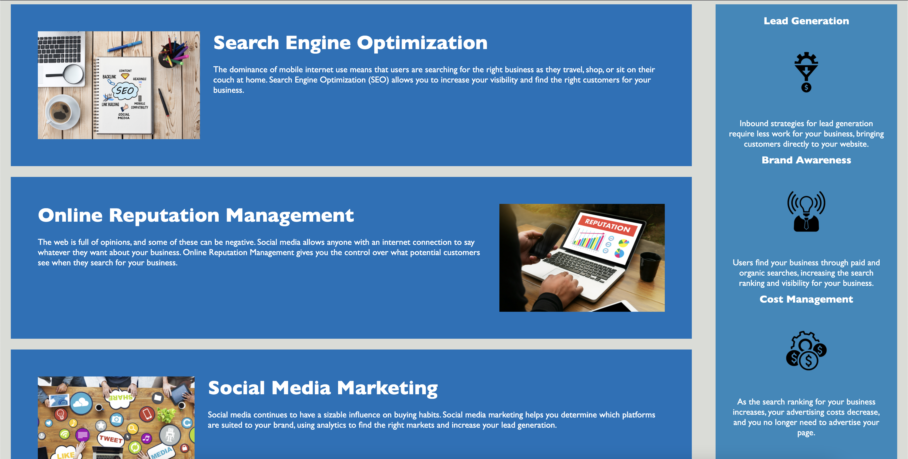

# refactorChallengerNY

## Updating html elements with semantic elements to optimize accessibility and searchability.

>Added title to head.

>Added header and footer elements.

>Added main element.

>Added nav element.

>Added semantic elements: main and section to the “content” .

>Added alt attributes to images.

>Added semantic elements: article & summary to the benefits sidebar .

>Fixed links.

>Edited html scaffold.

>Added notes to html.index .

## Optimizing CSS

Consolidated and renamed css selectors.

Added comments to style.css .

### After Changes 

